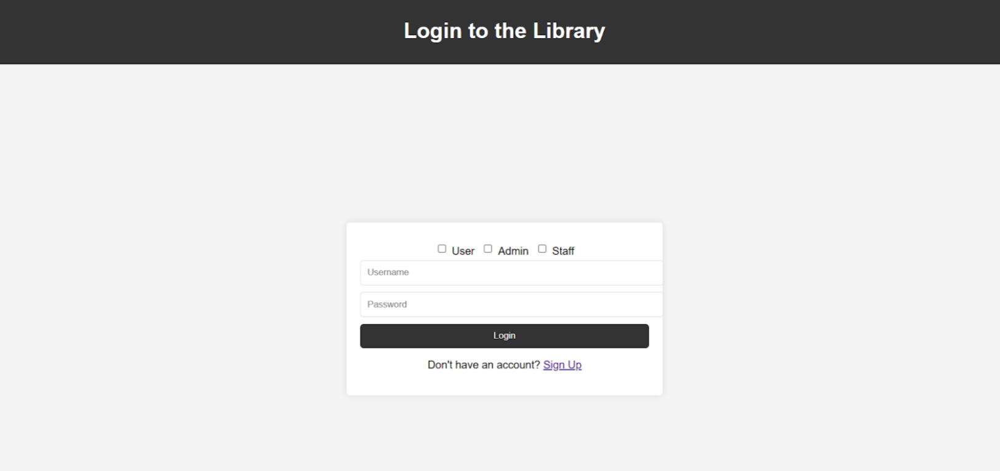
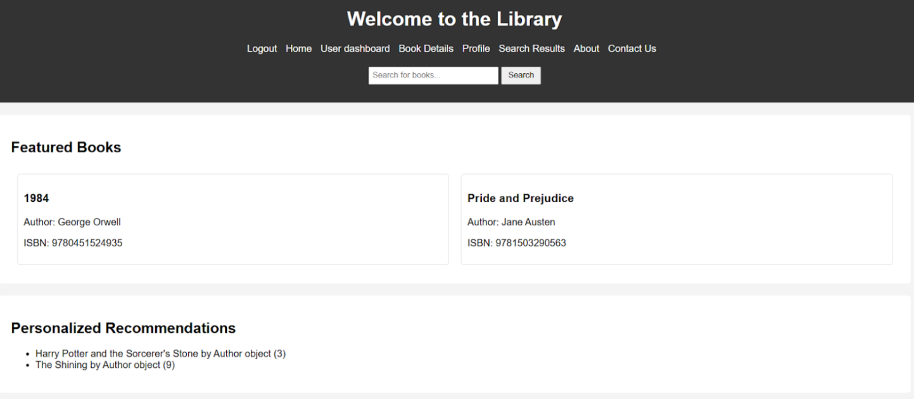
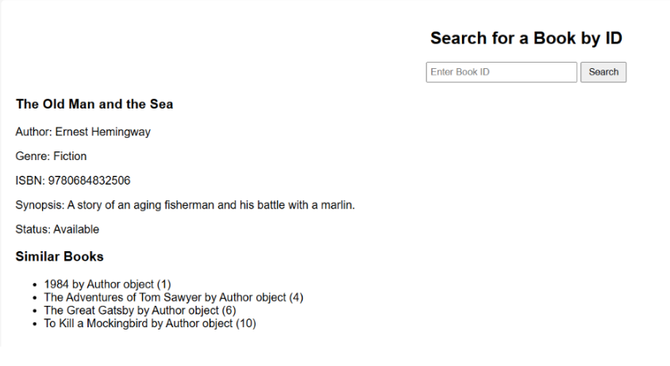
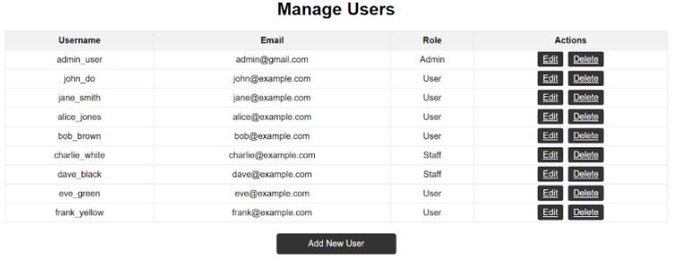

# 📚 Smart Library Management System

The **Smart Library Management System** is a digital solution designed to enhance library operations through automation and efficiency. It enables librarians to manage books, users, and transactions seamlessly while providing an intuitive experience for borrowers.

## 🔥 Key Features

### 📖 **Book Management**
- Add, update, delete, and search for books.
- Categorize books by **title, author, genre, and ISBN**.
- Track the availability status of books.

### 👤 **User Management**
- **Admin Dashboard**: Manage books, users, and transactions.
- **User Roles**: Differentiate between **admin and regular users**.
- **Borrower History**: Track borrowed and returned books.

### 🔄 **Borrow & Return System**
- Users can borrow books with **due date tracking**.
- Automatic alerts for **overdue books**.
- Maintain records of previous transactions.

### 📊 **Dashboard & Reports**
- View **real-time analytics** on book availability, active users, and overdue books.
- Generate **reports** on borrowing patterns.

### 🔍 **Advanced Search & Filters**
- Search books by **title, author, genre, or ISBN**.
- Filter books based on **availability, category, or popularity**.

---

## 🛠️ **Technologies Used**
- **Frontend**: *(Specify – React, Vue, or plain HTML/CSS/JavaScript if applicable)*
- **Backend**: **Django (Python)**
- **Database**: **MySQL**
---

## 🖼️ **Output Screenshots**
Here are some sample outputs from the system:

### 🏠 **Login View**
  
*The admin dashboard provides an overview of books, users, and transactions.*

### 📖 **Dashboard Section**
  
*This section allows admins to add, edit, and delete books.*

### 👤 **Search for Books Interface**
  
*Users can borrow books with due date tracking and notifications.*

### 📊 **Manage Users Admin Interface**
  
*Analytics and reports help in tracking borrowing trends and overdue books.*

---

## 📜 **License**
This project is licensed under the **MIT License**.

